#  1 文件组织结构
📌Docs目录：存放项目中所有文档、实验报告、相关图片以及演示场景视频

📌Src目录：存放项目代码

📌release目录：存放APP的apk安装包

📌images目录：存放图片

# 2 相关网页连接
🔗[代码仓库](https://gitee.com/imcaicai/library)

🔗[系统原型交互](https://www.figma.com/proto/CGypQMhJVQD08ZIIsiDeGe/%E5%9B%BE%E4%B9%A6%E9%A6%86%E7%B3%BB%E7%BB%9F?node-id=11%3A902&scaling=scale-down&starting-point-node-id=41%3A1813)

🔗[系统原型UI设计](https://www.figma.com/file/CGypQMhJVQD08ZIIsiDeGe/%E5%9B%BE%E4%B9%A6%E9%A6%86%E7%B3%BB%E7%BB%9F?node-id=0%3A1)

🔗[进度安排甘特图](https://gantt.mindsup.cn/share/V9TE66cKp)

# 3 关于项目
### 💡项目简介
基于Android客户端的图书馆应用系统，主要功能如下：

- 登录、注册、填写个人信息
- 扫码借/还书、搜索图书、收藏图书、推荐图书
- 查看我的借阅、我的收藏、个人读书报告
- 专注打卡计时、赚取金币解锁城市建筑
- 查看图书馆最新活动、重要通知
- 查看图书馆每个楼层地图
- 查看读者指南、失物招领信息

### 👩小组成员
| 登录名   | 姓名   | 贡献 |
| -------- | ------ | ---- |
| Imcaicai | 徐锦慧 | 100% |

### 🛠主要技术
- UI设计：`Figma`  `PS`
- Android端开发： `Java`  `MVVM架构`  `Zxing`  `Fragment`  `Grid`
- 数据库：`SQLite`  `Sharedpreferences`

# 使用方法

下载release文件中的apk安装包，按以下步骤即可体验各种功能，快来试一试吧！

#### 登录注册

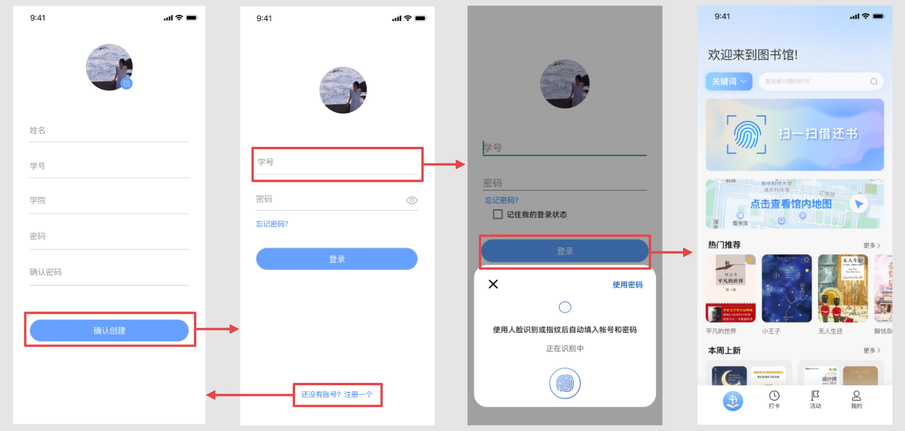

#### 查看地图

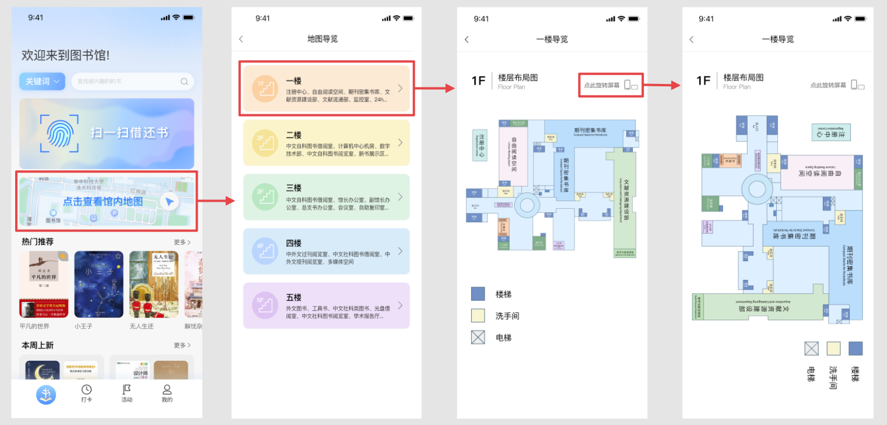

#### 借/还/收藏/推荐图书

任选其中一个二维码进行扫码借还图书：

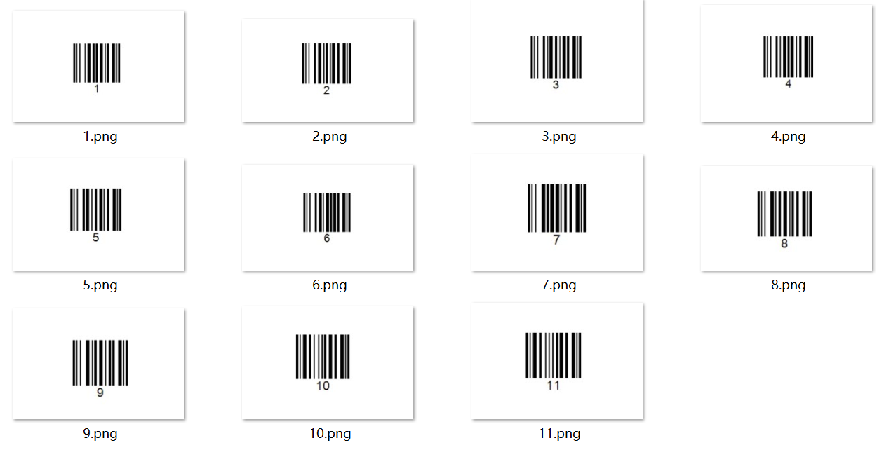

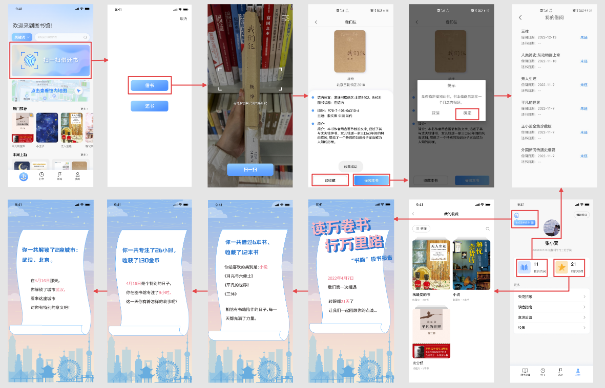

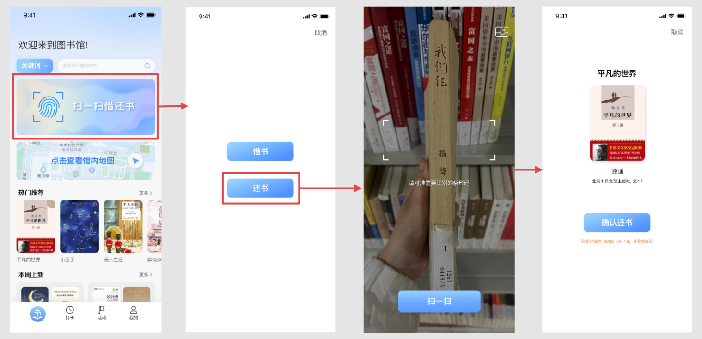

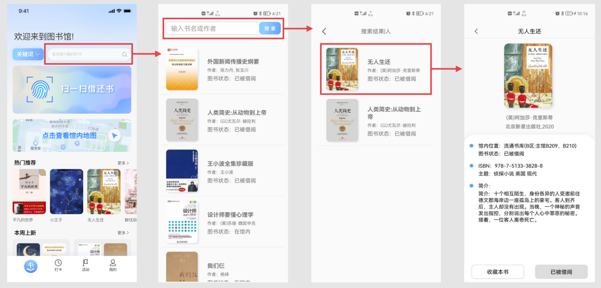

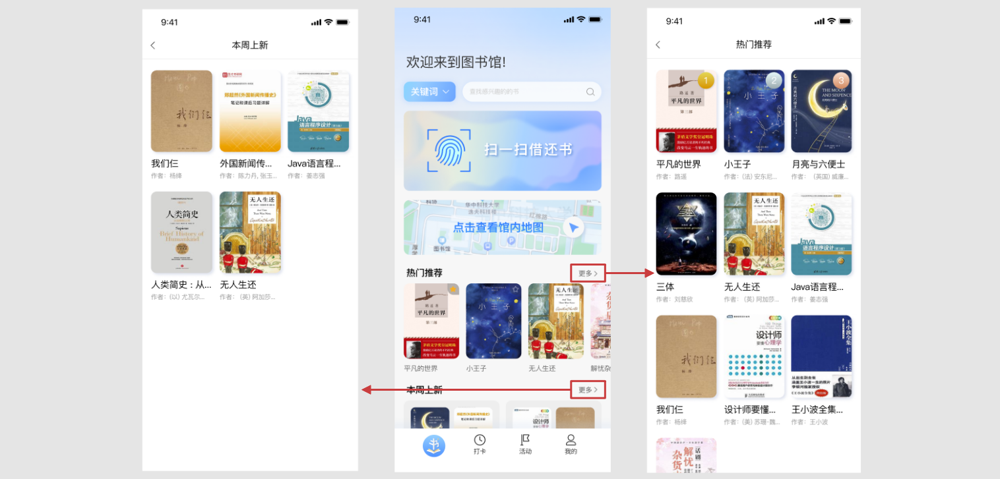

#### 专注打卡

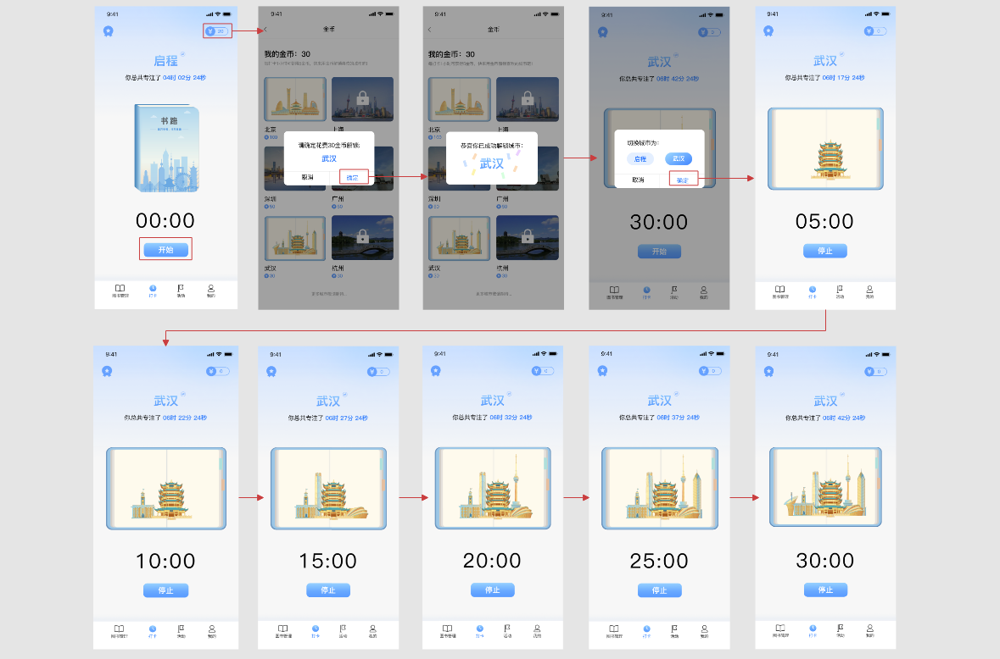

#### 活动通知

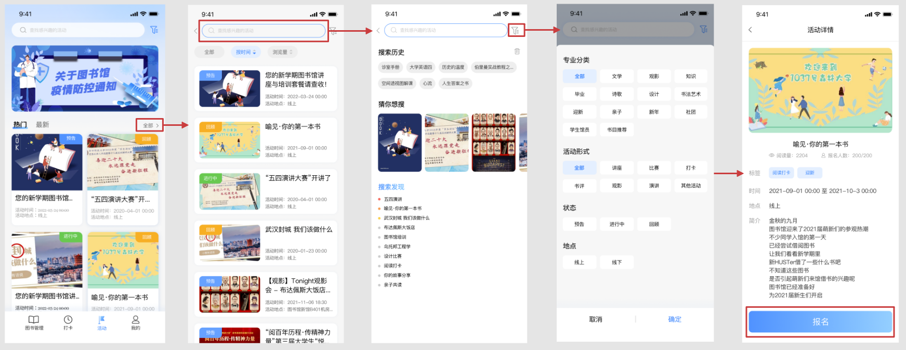

#### 失物招领

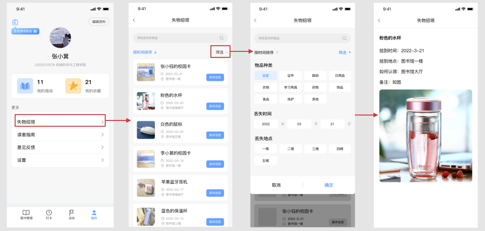

#### 读者指南/意见反馈/设置

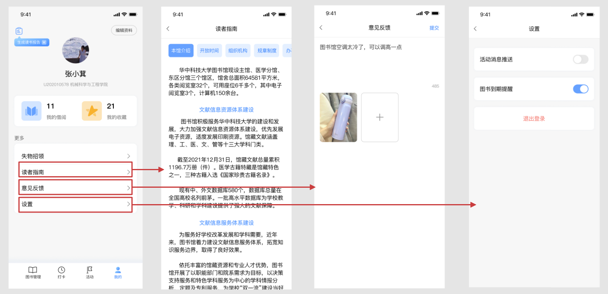

